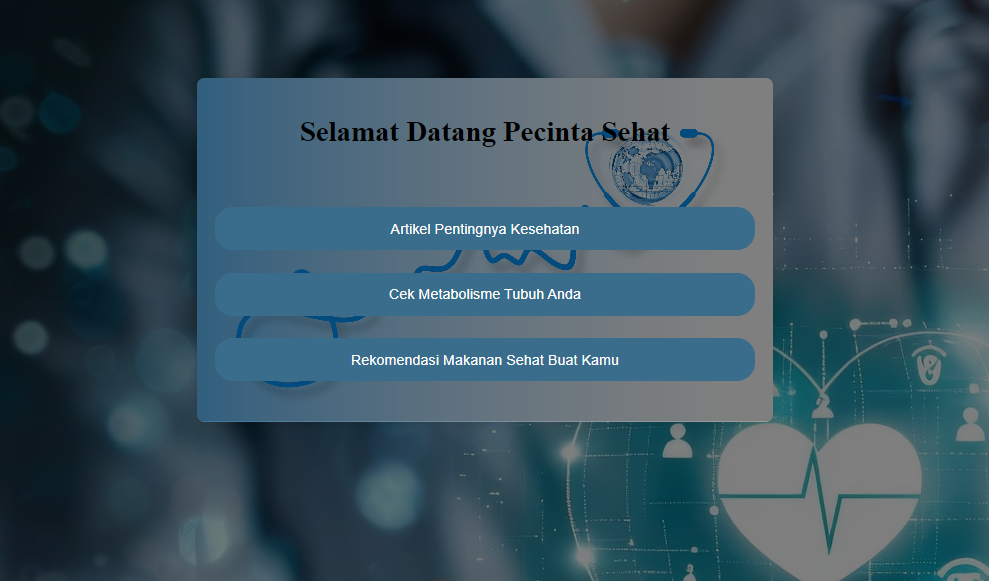
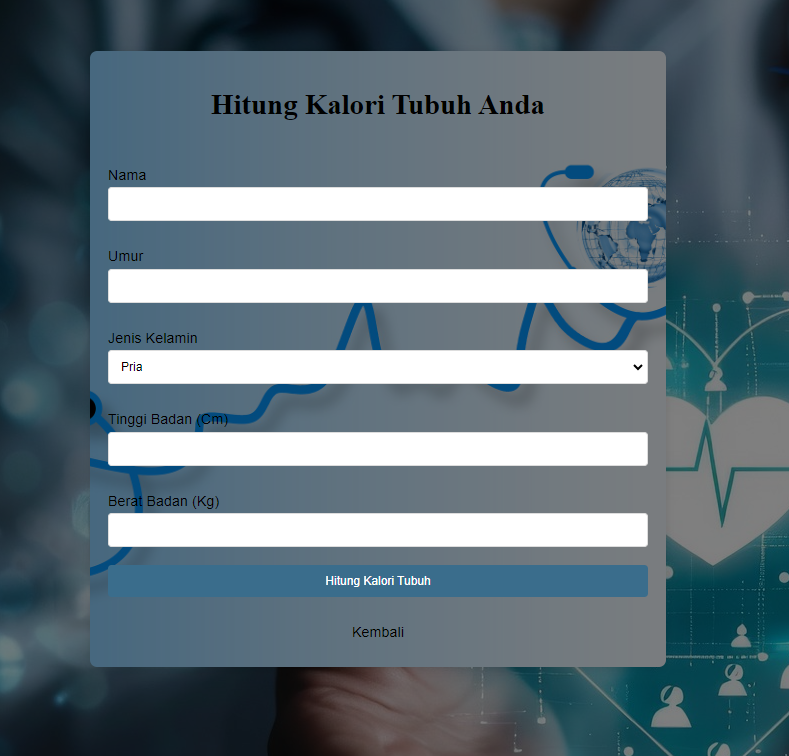
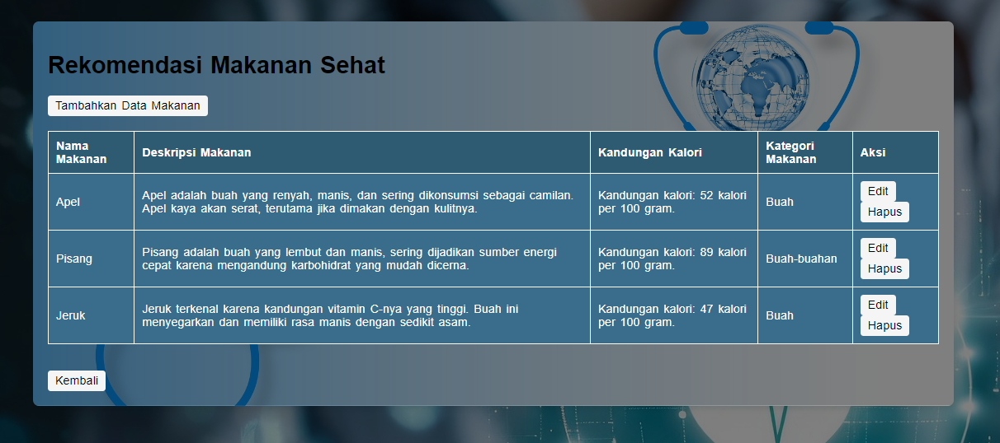

# Aplikasi Cek Kalori

Aplikasi sederhana ini adalah aplikasi yang dirancang untuk melihat dan mengetahui kalori yang kita butuhkan dalam kehidupan kita sehari-hari, yang berguna untuk tetap menjaga kesehatan tubuh kita.

## Gambaran Aplikasi

Aplikasi ini terdiri dari beberapa komponen utama:

1. **Halaman Selamat Datang (`selamat_datang.php`)**: Halaman beranda yang menyapa pengguna.

2. **Artikel (`artikel.html`)**: Halaman artikel yang berisi informasi tertentu.

3. **Kalkulator Kalori (`hitung_kalori.php`)**: Alat sederhana untuk menghitung kebutuhan kalori harian berdasarkan input pengguna.

4. **Rekomendasi (`MSG.php`)**: Halaman untuk memproses dan menampilkan pesan yang dikirimkan oleh pengguna.

### URL Aplikasi

- Halaman Selamat Datang: [http://localhost/app/Minggu-1/Senin/App/selamat_datang.php](http://localhost/app/Minggu-1/Senin/App/selamat_datang.php)
- Artikel: [http://localhost/app/Minggu-1/Senin/App/artikel.html](http://localhost/app/Minggu-1/Senin/App/artikel.html)
- Kalkulator Kalori: [http://localhost/app/Minggu-1/Senin/App/hitung_kalori.php](http://localhost/app/Minggu-1/Senin/App/hitung_kalori.php)
- Pengelola Pesan: [http://localhost/app/Minggu-1/Senin/App/MSG.php](http://localhost/app/Minggu-1/Senin/App/MSG.php)

## Fitur

1. **Halaman Selamat Datang** (`selamat_datang.php`)
   - Halaman yang menyapa pengguna dengan pesan ramah.

2. **Artikel** (`artikel.html`)
   - Halaman HTML statis yang menyajikan artikel informatif. Dirancang dengan tata letak yang bersih dan mudah dibaca.

3. **Kalkulator Kalori** (`hitung_kalori.php`)
   - Formulir yang memungkinkan pengguna memasukkan data fisik (seperti berat badan, tinggi badan, dan tingkat aktivitas) untuk menghitung kebutuhan kalori harian mereka.
   - Menggunakan logika PHP sederhana untuk memproses data.

4. **Pengelola Pesan** (`MSG.php`)
   - Halaman yang menangkap dan menampilkan pesan yang dikirimkan pengguna.
   - Menyertakan pemrosesan input dasar dan menampilkan data yang telah dikirim.

## Cara Menggunakan

1. Jalankan server lokal Anda (misalnya, XAMPP, MAMP).
2. Buka URL utama aplikasi: http://localhost/app/Minggu-1/Senin/App/

## Teknologi yang Digunakan

- **PHP**: Untuk memproses backend dan menangani pengiriman formulir.
- **HTML/CSS**: Untuk membuat halaman statis seperti artikel dan struktur antarmuka aplikasi.
